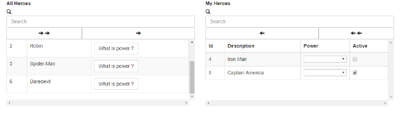

# dual-pick-list / AngularJS 1.6.x or lower

[](https://raw.githubusercontent.com/ouracademy/ngx-dual-listbox/master/LICENSE)


## Demo

<a href="https://github.com/caiquevallim/dual-pick-list-heroes">https://github.com/caiquevallim/dual-pick-list-heroes</a>




## Table of contents

- [About](#about)
- [Installation](#installation)
- [Documentation](#documentation)
- [Development](#development)
- [License](#license)

## About

The dual-pick-list has been created for help us to create a dual list box fastest in AngularJS 1.6.1 or lower.

## Installation

Install through npm:
```
$ npm install bootstrap@v3.3.6 --save
$ npm install bootstrap-duallistbox --save
$ npm install smart-table --save
$ npm install lodash --save
$ npm install dual-pick-list --save
```

Then include in your apps module (app.js):

```JavaScript
angular.module('app',['dual-pick-list']);
```

And now include in your app.scripts.json:

```JSON
{
    "chunks":{
        "vendor":[
            "dual-pick-list"
        ]
    },
    "paths":{
        "dual-pick-list":"node_modules/dual-pick-list/dual-pick-list.component.js"
    }
}
```

or also:

```HTML5
<script src="./node_modules/dual-pick-list/dual-pick-list.component.js"> </script>
```


Finally use in one of your apps components:

You're going to need to include in your HTML 5 file the following statment:
```HTML 5
    <dual-pick-list list="items"
                    on-transaction="onTransactionDualList(leftList, rightList)"
                    header-config="headerConfig"
                    text-key-left-list="{{'Not Selected'}}"
                    text-key-right-list="{{'Selected'}}">
    </dual-pick-list>
```

## Documentation
* Bindings:
    * `list` : `ArrayList[Item]`. This bind is `required`.
    * `headerConfig` : `{left:ArrayList[HConfig], right:ArrayList[HConfig]}`. This bind `required` and it's used to you setup header of your left list and header of your right list.
    * `onTransaction` : ` ()=>{}`. This bind `required`, when any event is dispatched, you can get left list and right list through the dual-pick-list component.
    * `textKeyLeftList` : `String leftLabel`. Name of left table. This bind is not `required`. It has a value `Not Selected` as default.
    * `textKeyRightList` : `String rightLabel`. Name of right table. This bind is not `required`. It has a value `Selected` as default.
    * `placeHolder` : `String placeholder`. Search input left and right.

* Models:
    * `Item`
        * property `left : Boolean` When it is `true` then the item will be located on left list
        * property `right : Boolean` When it is `true` then the item will be located on right list
        * property `fieldOfYourInterest` : For example: `cdClient`, `descClient` or any other that you will need

    * `HConfig`
        * property `text : String`. Name of the column.
        * property `hidden : Boolean`. If you need of some field to just your business and you do not want to show this for you client, so you'll need to hidden this collumn getting value `true` in this property.
        * property `key : String` This property should contain the name that you have been past on `Item.fieldOfYourInterest` property above
        * property `custom : Boolean` : `true` for you use some components in your records of this column
        * property `select : ObjectSelect`: It can not be `true` if `custom` has `false`
        * property `checkbox : Boolean`: It can not be `true` if `custom` has `false`
        * property `button : ()=>{}` Function which can manipulated the current item or any other events that you need. It can not be `true` if `custom` has `false`
    * `ObjectSelect`
        * property `list : ArrayList[ObjectSelect]` : This list should be mapped as `ObjectSelectItem`

    * `ObjectSelectItem`
        * property `id : number/long/int`: Id
        * property `text : String`: Name


## Development

### Prepare your environment
* Install [Node.js](http://nodejs.org/) and NPM
* Install local dev dependencies: `npm install` while current directory is this repo

## License

MIT
